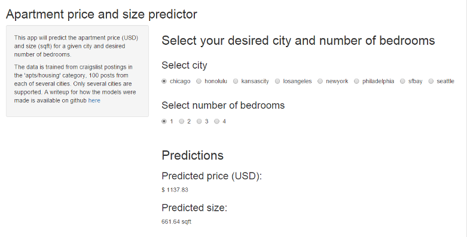
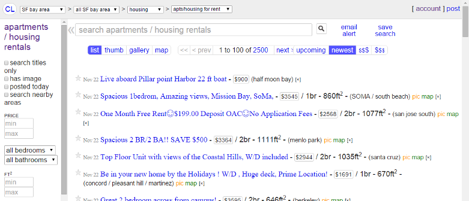
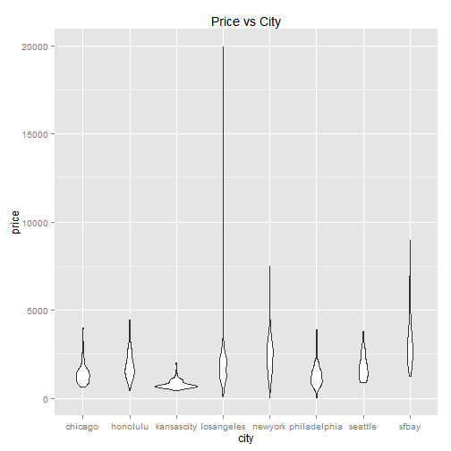
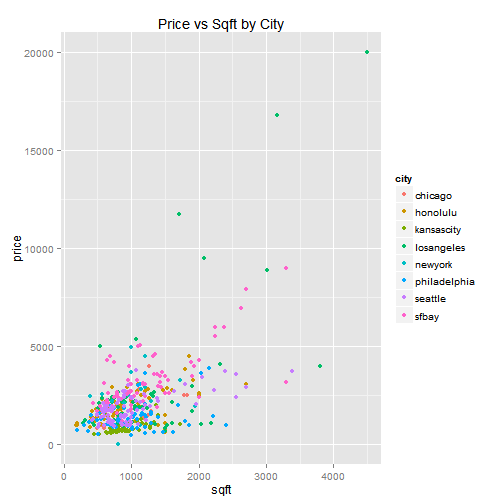

## Shiny app to predict apartment price ($) and size (sqft)

Link to app: [https://sueyic.shinyapps.io/shinyapp_apartment_pricesize_predictor](https://sueyic.shinyapps.io/shinyapp_apartment_pricesize_predictor)

---
## Data for models comes from craigslist

The prediction model was trained from craigslist posts obtained from the "apts/housing" category, for several cities in the United States. These are posts of residential apartments or housing for rent.

Example: "apts/housing" category for San Francisco bay area

---

## How does it work?

1. Most recent 100 craigslist "apts/housing" posts from each of 8 US cities were downloaded.
2. Data includes city, title, price, the number of bedrooms (optional), and square feet (optional).
3. This data was used to train two linear models.
    - price ~ city + bedrooms
    - sqft ~ city + bedrooms
3. Shiny app was built to allow a user to input a given city and desired of bedrooms; which uses the models to return a predicted price and size of apartment.

More detailed writeup: [Data processing report](https://github.com/sueyic/shinyapp-craigslist-housing/blob/master/data_processing/data_processing_report.pdf)

--- &twocol

## Exploratory plots

*** =left

 

*** =right
 

---

## Conclusion

- Code available at [github.com/sueyic/shinyapp-craigslist-housing](https://github.com/sueyic/shinyapp-craigslist-housing)
- Looking forward to feedback!
